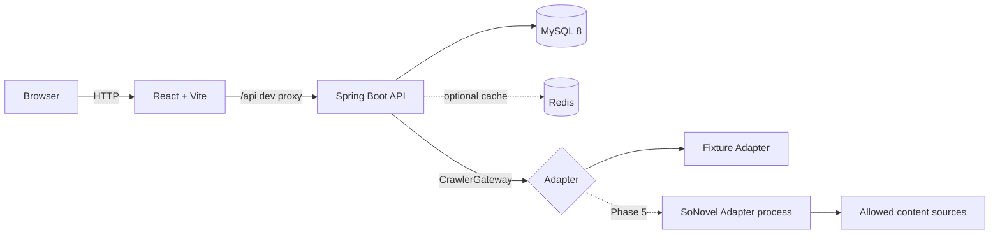
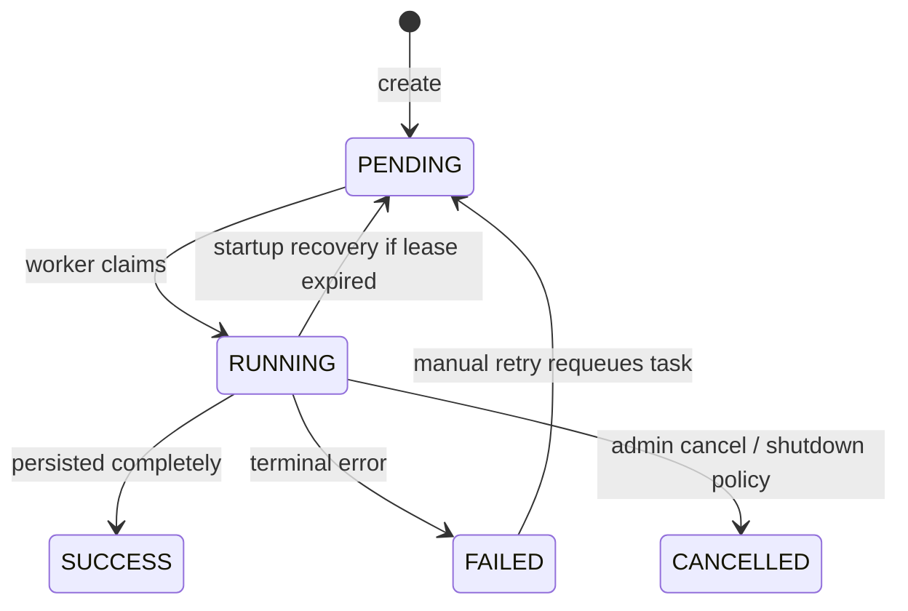

# xmreader（小麦中文网）系统架构

> Phase 1 设计文档。当前目标是本地稳定运行和完整业务闭环；生产部署不是本阶段验收项。

## 1. 架构决策

xmreader 第一版采用前后端分离的模块化单体：React 单页应用、一个 Spring Boot API、一个 MySQL 数据库。Crawler Adapter 保持独立进程边界，但在接入 so-novel 前先由 fixture 实现替代。Redis、Nginx 和完整容器化均为后续可选项。

这样可以在一台开发机上保持简单的调试链路，同时保留未来拆分采集服务的接口边界。



### 1.1 当前明确不引入

- 微服务注册中心、API Gateway
- Kafka/RabbitMQ
- Elasticsearch
- Kubernetes
- 分布式事务和复杂 CQRS
- WebSocket（任务状态使用 2 秒轮询）

## 2. 技术栈

| 层 | 选型 | 说明 |
|---|---|---|
| Frontend | React、TypeScript、Vite | SPA，PC 优先并适配移动阅读 |
| UI | Ant Design | 管理台和通用交互；阅读器使用轻量自定义样式 |
| Routing/Data | React Router、TanStack Query | 路由与服务端状态 |
| Client state | Zustand | 仅保存认证展示状态、阅读设置等客户端状态 |
| Backend | Java 25、Spring Boot 3 | 单一可执行 API 应用 |
| Security | Spring Security、JWT、BCrypt | Access JWT + 可撤销 refresh session |
| Persistence | MyBatis-Plus、Flyway | Mapper 持久化与版本化迁移 |
| Database | MySQL 8, InnoDB, utf8mb4 | 业务数据和可靠任务状态 |
| Cache | Redis（可选） | 后续仅缓存书籍详情和目录，不作为正确性来源 |
| Crawler | `CrawlerGateway` + Adapter | 主业务不依赖 so-novel 内部 API |

版本号在 Phase 2 创建脚手架时固定，并提交 lockfile；不使用浮动版本。

## 3. 代码仓库结构

```text
xmreader/
├─ frontend/                    # React 应用
│  ├─ src/api/
│  ├─ src/components/
│  ├─ src/features/             # auth/books/reader/library/admin
│  ├─ src/layouts/
│  ├─ src/routes/
│  ├─ src/stores/
│  └─ src/styles/
├─ backend/                     # Spring Boot 模块化单体
│  ├─ src/main/java/.../xmreader/
│  ├─ src/main/resources/
│  │  ├─ application.yml
│  │  └─ db/migration/
│  └─ src/test/
├─ crawler/
│  ├─ README.md
│  ├─ contract/                 # Adapter 契约示例/schema
│  └─ sonovel-adapter/          # Phase 5 才创建
├─ docs/
└─ README.md
```

生产用 `deploy/` 和根目录 Compose 文件等核心功能稳定后再加入。

## 4. 后端模块边界

后端采用按业务能力优先、模块内分层的包结构：

```text
com.xmreader
├─ auth/        controller, application, domain, persistence, dto
├─ user/
├─ catalog/     books, chapters, local search, homepage
├─ library/     bookshelf, reading progress, reading history
├─ crawler/     tasks, worker, gateway, adapter DTO
├─ admin/       dashboard and administration use cases
└─ shared/      security, config, response, exception, time
```

依赖规则：

- Controller 只处理协议、校验和身份上下文，调用 application service。
- Application service 组织用例和事务，不返回持久化 Entity。
- Mapper 只能被对应模块的 persistence/application 层调用。
- 模块之间通过 service facade 或明确的只读查询接口协作，禁止跨模块直接调用 Mapper。
- `shared` 只放真正跨模块的基础设施，不放业务杂物。
- DTO、VO、Entity 分离；映射先使用明确的工厂/方法，确有大量重复时再引入 MapStruct。

## 5. 前端边界

页面路由：

```text
Public:  /, /search, /book/:id, /book/:id/chapters,
         /book/:bookId/read/:chapterId, /login, /register
User:    /bookshelf, /history, /profile
Admin:   /admin, /admin/books, /admin/crawler, /admin/tasks
```

状态归属：

- TanStack Query：用户资料、书籍、章节、书架、进度、任务等服务端状态。
- Zustand：本地认证展示状态和阅读器偏好；不复制 Query 缓存。
- localStorage：字体大小、行距、内容宽度、主题。Token 不写入 localStorage。
- Refresh token：HttpOnly、SameSite cookie；Access token 首版保存在内存，刷新页面时通过 refresh 恢复会话。

阅读正文以纯文本段落渲染，不使用未经清洗的 `dangerouslySetInnerHTML`。若后续必须支持受限 HTML，后端先清洗，前端仍使用 allowlist sanitizer 作为纵深防御。

## 6. 认证与授权

### 6.1 会话模型

- 密码使用 BCrypt，永不记录明文或可逆密文。
- 登录返回短时 Access JWT，并通过 HttpOnly cookie 下发随机 Refresh token。
- 数据库只保存 Refresh token 的 SHA-256 哈希、过期时间和撤销时间。
- 刷新时轮换 Refresh token；发现已撤销 token 重用时撤销该会话。
- 登出撤销当前 session 并清理 cookie。
- Access JWT 至少含 `sub`、`role`、`sid`、`iat`、`exp`、`jti`；服务端严格校验算法、签发者和有效期。

### 6.2 权限

| 能力 | Anonymous | USER | ADMIN |
|---|---:|---:|---:|
| 浏览、搜索、阅读 | ✓ | ✓ | ✓ |
| 书架、进度、历史、资料 |  | ✓ | ✓ |
| 导入、更新、任务管理 |  |  | ✓ |
| 用户和异常内容管理 |  |  | ✓ |

基于角色的路由限制只是一层保护；所有资源归属必须在应用服务查询中再次校验。

## 7. 采集任务架构

### 7.1 职责划分

Spring Boot 负责：

- 校验管理员权限和输入 URL。
- 创建、去重、持久化任务。
- 控制状态转换、重试次数和后台执行并发。
- 接收规范化结果并事务性写入 books/chapters。
- 增量比较、缓存失效、日志和审计。

Crawler Adapter 负责：

- 仅访问启用的内容来源。
- 按固定版本规则解析搜索、详情、目录和单章正文。
- 实施来源级超时、限速和有限重试。
- 返回规范化数据和错误，不直接访问 xmreader 数据库。

### 7.2 状态机



允许的数据库状态为 `PENDING/RUNNING/SUCCESS/FAILED/CANCELLED`。只有应用服务能改变状态。每次转换使用 `version` 乐观锁或条件更新，避免两个 worker 同时完成同一任务。

任务进度 `0..100` 只用于展示；成功条件是预期数据已经提交，而不是进度等于 100。

### 7.3 执行与恢复

- API 创建任务后立即返回 `202 Accepted` 和 task ID。
- 单机首版使用容量有界的 `ThreadPoolTaskExecutor`；默认同时运行 2 个书籍任务，每个来源最多 2–4 个章节请求。
- worker 先通过条件更新将 `PENDING` 认领为 `RUNNING`，写入 `lease_until`。
- 执行中定期更新 lease、计数和日志，但不在一个长事务中包住网络请求。
- 服务重启后扫描 lease 已过期的 `RUNNING` 任务：未超过最大尝试次数则回到 `PENDING`，否则标记 `FAILED`。
- Adapter 内部的自动网络重试只处理幂等步骤并使用退避，单次任务执行最多 3 次请求尝试。管理员“重试”会增加同一任务的 `attempt_count` 并重新排队，完整过程写入任务日志；重新排队前必须再次校验输入。
- 同一本书同时只能存在一个活跃 IMPORT/UPDATE 任务，由数据库生成列唯一索引兜底。

### 7.4 导入与增量更新

导入：

1. URL allowlist 与 SSRF 校验。
2. 创建任务并后台认领。
3. 获取详情并按 `(source_key, source_book_id)` 或 URL hash 幂等 upsert book。
4. 获取目录，规范化 `chapter_index`。
5. 逐章抓取；正文先规范化为安全纯文本。
6. 每批 20–50 章短事务 upsert，更新任务计数。
7. 全部成功后更新书籍最新章节并标记任务成功。

更新先读取最新目录，仅抓取数据库中不存在的 `(book_id, chapter_index)`。如果相同 index 的标题或 URL 变化，记录异常而不是静默覆盖大量正文。第一版不实现章节重排自动修复。

## 8. 一致性和事务边界

- 注册用户、创建 session：单事务。
- 加入/移除书架、保存阅读进度：各自单个短事务，唯一键保证幂等。
- 创建任务：任务插入和首条日志同事务；线程调度失败不丢任务，扫描器稍后会认领。
- 网络抓取不持有数据库事务。
- 章节批量落库：每批独立事务；任务失败时已成功章节保留，重试通过唯一键跳过。
- 最后一个批次提交后，单独事务更新 book 汇总字段和任务终态。
- Redis 永远是旁路缓存；删除缓存失败不能回滚数据库提交，使用短 TTL 保证最终恢复。

## 9. 安全边界

### 9.1 SSRF

管理员输入 URL 仍然不可信：

- 仅允许 `https`，确有历史来源需要时按 source 单独允许 `http`。
- 禁止 URL user-info、非标准端口和超长 URL。
- hostname 必须属于启用书源 allowlist，不能仅做字符串后缀匹配。
- DNS 解析后的所有地址必须为公网地址；禁止 loopback、private、link-local、multicast、unspecified、IPv4-mapped IPv6 和云 metadata 地址。
- 每次重定向重新执行完整校验，并限制重定向次数。
- Adapter 建立连接后校验实际 remote address，降低 DNS rebinding 风险。
- 限制响应体、超时、压缩解压后大小和内容类型。

### 9.2 Web/API

- MyBatis 使用参数绑定，动态排序只能映射 allowlist 字段。
- 所有写接口进行 Bean Validation，统一处理错误，不回传堆栈。
- Cookie 认证相关接口实施 SameSite 和 CSRF 防护；Bearer API 不依赖跨站 cookie 完成业务写入。
- CORS 本地只允许配置的 Vite origin。
- 登录、注册、刷新和采集任务创建实施速率限制。
- 日志不写密码、JWT、refresh token、Cookie、完整正文或敏感查询参数。

## 10. 缓存策略（后续启用）

缓存键必须含 schema version，例如：

```text
xmreader:v1:book:{bookId}
xmreader:v1:book:{bookId}:chapters:{page}:{pageSize}
```

- 书籍详情 TTL 10 分钟，目录 TTL 5 分钟并增加少量随机抖动。
- 书籍/章节更新提交后删除对应缓存。
- 不缓存用户书架、进度、认证或采集任务状态。
- Redis 不可用时直接访问 MySQL，不能阻止应用启动或核心阅读流程。

## 11. 可观测性

- 所有请求生成/透传 `X-Request-Id`，响应返回相同 ID。
- 采集日志包含 `taskId/sourceKey/bookId/chapterIndex/errorCode`。
- `/actuator/health/liveness` 只表示进程存活；`readiness` 检查 MySQL。Redis 可选时不影响 readiness。
- 本地默认 INFO，测试中禁止依赖人工阅读日志判断成功。
- 管理台统计从数据库聚合；第一版不引入 Prometheus。

## 12. 本地运行目标

Phase 2 的最低验收：

```text
MySQL         localhost:3306（仅本机或开发容器映射）
Backend       http://localhost:8080
Frontend      http://localhost:5173
Backend API   http://localhost:8080/api
```

前端通过 Vite proxy 访问 `/api`，不在代码中硬编码后端地址。后端 `local` profile 从环境变量读取数据库密码和 JWT 密钥；仓库只提交 `.env.example`，不提交 `.env`。

## 13. 架构验收标准

- 核心功能在 Redis、Nginx、so-novel 均未启动时可使用 fixture 数据完成测试。
- API 请求不会同步执行长时间采集。
- 任意服务重启不会把任务永久留在不可恢复的 RUNNING 状态。
- 重复提交和重复执行不会产生重复书籍、章节、书架或进度记录。
- 主业务代码不导入 `com.pcdd.sonovel.*`。
- 未授权用户不能调用管理端 API，普通用户不能访问其他用户的资源。
- 所有采集出站 URL 在连接前和重定向后经过 SSRF 校验。
