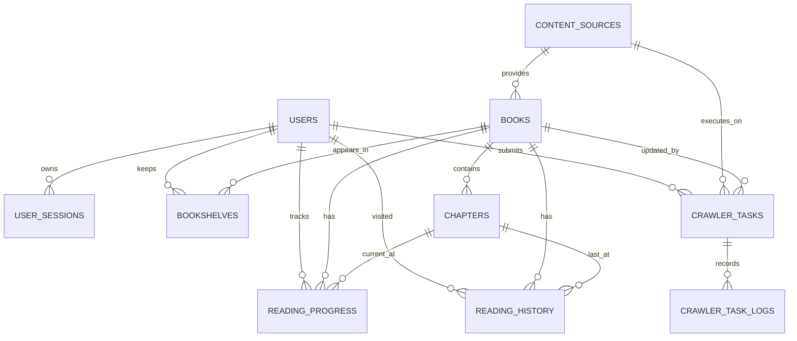

# NovelHub 数据库设计

> Phase 1 逻辑设计。目标数据库为 MySQL 8，存储引擎 InnoDB，字符集 `utf8mb4`，排序规则统一为 `utf8mb4_0900_ai_ci`。

## 1. 设计原则

- 主键统一使用应用生成的 `BIGINT UNSIGNED`（雪花 ID 或等价实现），避免把自增规律暴露为安全边界；API 仍按字符串安全传输 64 位 ID。
- 时间统一保存 UTC `DATETIME(3)`，API 输出 ISO-8601 UTC；展示时由前端转换时区。
- 状态使用 `VARCHAR` + `CHECK`，避免 MySQL `ENUM` 给迁移带来的限制。
- 长 URL 保存原文，并额外保存规范化 URL 的 SHA-256 `BINARY(32)` 用于唯一约束和索引。
- 所有外键列均建立索引；级联删除只用于会话、书架等明确从属数据。
- 小说使用软删除，避免管理员误操作级联删除大量章节。
- 正文保存规范化纯文本到 `LONGTEXT`，不保存未清洗的任意 HTML。
- 第一版不建立 FULLTEXT，也不引入 Elasticsearch。

## 2. ER 关系



第一版把“同一本作品在不同网站的版本”视为不同 source book，不自动按书名/作者合并。这避免误合并同名作品。以后如确需统一作品视图，再增加 canonical work 与 edition 映射，不在 MVP 中提前建模。

## 3. 表设计

### 3.1 `users`

| 字段 | 类型 | 约束/说明 |
|---|---|---|
| `id` | BIGINT UNSIGNED | PK |
| `username` | VARCHAR(32) | NOT NULL，规范化小写后唯一 |
| `password_hash` | VARCHAR(100) | NOT NULL，BCrypt hash |
| `nickname` | VARCHAR(64) | NOT NULL |
| `avatar_url` | VARCHAR(2048) | NULL |
| `role` | VARCHAR(16) | `USER/ADMIN` |
| `status` | VARCHAR(16) | `ACTIVE/DISABLED` |
| `created_at` | DATETIME(3) | NOT NULL |
| `updated_at` | DATETIME(3) | NOT NULL |

索引：

- `UNIQUE uk_users_username (username)`
- `INDEX idx_users_status_created (status, created_at)`

用户名只允许 ASCII 字母、数字和下划线，长度 3–32；展示名使用 `nickname`。

### 3.2 `user_sessions`

| 字段 | 类型 | 约束/说明 |
|---|---|---|
| `id` | BIGINT UNSIGNED | PK，同时作为 JWT `sid` |
| `user_id` | BIGINT UNSIGNED | FK users |
| `refresh_token_hash` | BINARY(32) | NOT NULL，唯一 |
| `expires_at` | DATETIME(3) | NOT NULL |
| `revoked_at` | DATETIME(3) | NULL |
| `last_used_at` | DATETIME(3) | NULL |
| `created_at` | DATETIME(3) | NOT NULL |

索引与外键：

- `UNIQUE uk_sessions_token_hash (refresh_token_hash)`
- `INDEX idx_sessions_user_active (user_id, revoked_at, expires_at)`
- `FOREIGN KEY (user_id) REFERENCES users(id) ON DELETE CASCADE`

数据库中不保存 refresh token 原文。过期或撤销 session 可由定时清理任务删除。

### 3.3 `content_sources`

这是 NovelHub 认可的来源注册表，不保存可执行规则正文。

| 字段 | 类型 | 约束/说明 |
|---|---|---|
| `id` | BIGINT UNSIGNED | PK |
| `source_key` | VARCHAR(64) | 稳定机器标识，唯一 |
| `display_name` | VARCHAR(100) | 来源名称 |
| `base_url` | VARCHAR(512) | 允许的来源根地址 |
| `adapter_type` | VARCHAR(32) | `FIXTURE/SONOVEL` |
| `enabled` | TINYINT(1) | NOT NULL，默认 1 |
| `rate_limit_per_minute` | SMALLINT UNSIGNED | NULL，来源级限制 |
| `created_at` | DATETIME(3) | NOT NULL |
| `updated_at` | DATETIME(3) | NOT NULL |

索引：

- `UNIQUE uk_sources_key (source_key)`
- `UNIQUE uk_sources_base_url (base_url)`
- `INDEX idx_sources_enabled (enabled)`

`source_key` 不使用 so-novel 动态分配的数字 rule ID。规则文件由 Adapter 固定版本管理，数据库只控制可用性和安全 allowlist。

### 3.4 `books`

| 字段 | 类型 | 约束/说明 |
|---|---|---|
| `id` | BIGINT UNSIGNED | PK |
| `source_id` | BIGINT UNSIGNED | FK content_sources |
| `source_book_id` | VARCHAR(255) | 来源稳定 ID；没有时为 NULL |
| `source_url` | VARCHAR(2048) | 规范化后的详情页 URL |
| `source_url_hash` | BINARY(32) | SHA-256，NOT NULL |
| `title` | VARCHAR(255) | NOT NULL |
| `author` | VARCHAR(128) | NOT NULL |
| `cover_url` | VARCHAR(2048) | NULL |
| `description` | TEXT | NULL，清洗后的纯文本 |
| `category` | VARCHAR(64) | NULL |
| `status` | VARCHAR(32) | `ONGOING/COMPLETED/PAUSED/UNKNOWN` |
| `visibility` | VARCHAR(16) | `VISIBLE/HIDDEN` |
| `word_count` | BIGINT UNSIGNED | NOT NULL，默认 0 |
| `chapter_count` | INT UNSIGNED | NOT NULL，默认 0 |
| `latest_chapter_id` | BIGINT UNSIGNED | NULL，逻辑引用 chapters |
| `latest_chapter_title` | VARCHAR(255) | NULL，列表展示快照 |
| `last_crawled_at` | DATETIME(3) | NULL |
| `deleted_at` | DATETIME(3) | NULL，软删除 |
| `created_at` | DATETIME(3) | NOT NULL |
| `updated_at` | DATETIME(3) | NOT NULL |

索引与约束：

- `UNIQUE uk_books_source_book (source_id, source_book_id)`；MySQL 允许多个 NULL。
- `UNIQUE uk_books_source_url_hash (source_id, source_url_hash)`。
- `INDEX idx_books_title (title)`。
- `INDEX idx_books_author (author)`。
- `INDEX idx_books_updated (visibility, deleted_at, updated_at)`。
- `INDEX idx_books_latest_chapter (latest_chapter_id)`。
- `FOREIGN KEY (source_id) REFERENCES content_sources(id) ON DELETE RESTRICT`。

`latest_chapter_id` 不建立外键，以避免 books/chapters 循环建表与批量导入障碍；应用层更新前必须验证章节属于该书。

### 3.5 `chapters`

| 字段 | 类型 | 约束/说明 |
|---|---|---|
| `id` | BIGINT UNSIGNED | PK |
| `book_id` | BIGINT UNSIGNED | FK books |
| `chapter_index` | INT UNSIGNED | 从 1 开始的稳定展示顺序 |
| `title` | VARCHAR(255) | NOT NULL |
| `content` | LONGTEXT | NOT NULL，规范化纯文本 |
| `content_hash` | BINARY(32) | 正文 SHA-256，用于变更检测 |
| `source_url` | VARCHAR(2048) | NULL |
| `source_url_hash` | BINARY(32) | NULL |
| `word_count` | INT UNSIGNED | NOT NULL，默认 0 |
| `published_at` | DATETIME(3) | NULL，来源可提供时填写 |
| `created_at` | DATETIME(3) | NOT NULL |
| `updated_at` | DATETIME(3) | NOT NULL |

索引与约束：

- `UNIQUE uk_chapters_book_index (book_id, chapter_index)`。
- `UNIQUE uk_chapters_book_url_hash (book_id, source_url_hash)`。
- `INDEX idx_chapters_book_updated (book_id, updated_at)`。
- `FOREIGN KEY (book_id) REFERENCES books(id) ON DELETE RESTRICT`。
- `CHECK (chapter_index >= 1)`。

正文上限还需在应用层限制；抓取响应和清洗后正文都不能无限写入。

### 3.6 `bookshelves`

| 字段 | 类型 | 约束/说明 |
|---|---|---|
| `id` | BIGINT UNSIGNED | PK |
| `user_id` | BIGINT UNSIGNED | FK users |
| `book_id` | BIGINT UNSIGNED | FK books |
| `created_at` | DATETIME(3) | NOT NULL |

索引与外键：

- `UNIQUE uk_bookshelves_user_book (user_id, book_id)`。
- `INDEX idx_bookshelves_user_created (user_id, created_at)`。
- 两个外键均 `ON DELETE CASCADE`；books 使用软删除，正常不会触发。

重复加入书架按幂等成功处理，不返回 500。

### 3.7 `reading_progress`

| 字段 | 类型 | 约束/说明 |
|---|---|---|
| `id` | BIGINT UNSIGNED | PK |
| `user_id` | BIGINT UNSIGNED | FK users |
| `book_id` | BIGINT UNSIGNED | FK books |
| `chapter_id` | BIGINT UNSIGNED | FK chapters |
| `position` | INT UNSIGNED | 章节内字符偏移，默认 0 |
| `progress_percent` | DECIMAL(5,2) | `0.00..100.00` |
| `updated_at` | DATETIME(3) | NOT NULL |

索引与约束：

- `UNIQUE uk_progress_user_book (user_id, book_id)`。
- `INDEX idx_progress_user_updated (user_id, updated_at)`。
- user/book/chapter 外键均为 `ON DELETE CASCADE`。
- `CHECK (progress_percent BETWEEN 0 AND 100)`。

外键无法保证 `chapter_id` 属于 `book_id`，应用服务必须在同一查询/事务内校验。

### 3.8 `reading_history`

第一版保存“每个用户每本书最近一次访问”，而不是每次滚动生成事件，避免数据无界增长。

| 字段 | 类型 | 约束/说明 |
|---|---|---|
| `id` | BIGINT UNSIGNED | PK |
| `user_id` | BIGINT UNSIGNED | FK users |
| `book_id` | BIGINT UNSIGNED | FK books |
| `chapter_id` | BIGINT UNSIGNED | FK chapters |
| `visited_at` | DATETIME(3) | NOT NULL |

索引与约束：

- `UNIQUE uk_history_user_book (user_id, book_id)`。
- `INDEX idx_history_user_visited (user_id, visited_at)`。
- user/book/chapter 外键均为 `ON DELETE CASCADE`。

保存阅读进度时同步 upsert 此表。匿名用户历史只在浏览器本地保存。

### 3.9 `crawler_tasks`

| 字段 | 类型 | 约束/说明 |
|---|---|---|
| `id` | BIGINT UNSIGNED | PK |
| `public_id` | CHAR(26) | API 使用的 ULID，唯一 |
| `type` | VARCHAR(24) | `IMPORT_BOOK/UPDATE_BOOK` |
| `status` | VARCHAR(16) | `PENDING/RUNNING/SUCCESS/FAILED/CANCELLED` |
| `source_id` | BIGINT UNSIGNED | FK content_sources |
| `book_id` | BIGINT UNSIGNED | UPDATE 必填，IMPORT 初始可空 |
| `source_url` | VARCHAR(2048) | IMPORT 使用的规范化 URL |
| `source_url_hash` | BINARY(32) | NULL |
| `dedup_key` | BINARY(32) | 类型 + 来源 + 目标的 SHA-256 |
| `active_dedup_key` | BINARY(32) | 生成列，见下文 |
| `progress` | TINYINT UNSIGNED | `0..100` |
| `total_chapters` | INT UNSIGNED | NOT NULL，默认 0 |
| `completed_chapters` | INT UNSIGNED | NOT NULL，默认 0 |
| `failed_chapters` | INT UNSIGNED | NOT NULL，默认 0 |
| `attempt_count` | TINYINT UNSIGNED | NOT NULL，初始 0 |
| `max_attempts` | TINYINT UNSIGNED | NOT NULL，默认 3 |
| `error_code` | VARCHAR(64) | NULL，稳定机器错误码 |
| `error_message` | VARCHAR(1000) | NULL，已脱敏摘要 |
| `lease_until` | DATETIME(3) | NULL，worker 租约 |
| `version` | INT UNSIGNED | NOT NULL，乐观锁 |
| `created_by` | BIGINT UNSIGNED | FK users |
| `created_at` | DATETIME(3) | NOT NULL |
| `started_at` | DATETIME(3) | NULL |
| `finished_at` | DATETIME(3) | NULL |
| `updated_at` | DATETIME(3) | NOT NULL |

生成列：

```sql
active_dedup_key BINARY(32)
  GENERATED ALWAYS AS (
    CASE WHEN status IN ('PENDING', 'RUNNING') THEN dedup_key ELSE NULL END
  ) STORED
```

索引与约束：

- `UNIQUE uk_tasks_public_id (public_id)`。
- `UNIQUE uk_tasks_active_dedup (active_dedup_key)`；唯一索引允许多个 NULL，只阻止相同活跃任务。
- `INDEX idx_tasks_status_created (status, created_at)`。
- `INDEX idx_tasks_book_created (book_id, created_at)`。
- `INDEX idx_tasks_lease (status, lease_until)`。
- `INDEX idx_tasks_creator_created (created_by, created_at)`。
- source/book/created_by 使用 `ON DELETE RESTRICT`。
- `CHECK (progress <= 100 AND completed_chapters + failed_chapters <= total_chapters)`。

手动重试复用任务行：仅允许 `FAILED -> PENDING`，清空终态时间和错误摘要、增加 `attempt_count`，完整历史保留在日志表。达到 `max_attempts` 后拒绝自动重试；管理员如需重新尝试，应新建任务。

### 3.10 `crawler_task_logs`

| 字段 | 类型 | 约束/说明 |
|---|---|---|
| `id` | BIGINT UNSIGNED | PK |
| `task_id` | BIGINT UNSIGNED | FK crawler_tasks |
| `level` | VARCHAR(8) | `INFO/WARN/ERROR` |
| `event_type` | VARCHAR(64) | 稳定事件类型 |
| `chapter_index` | INT UNSIGNED | NULL |
| `message` | VARCHAR(1000) | 脱敏的人类可读消息 |
| `details` | JSON | NULL，小型结构化诊断信息 |
| `created_at` | DATETIME(3) | NOT NULL |

索引与外键：

- `INDEX idx_task_logs_task_created (task_id, created_at)`。
- `INDEX idx_task_logs_level_created (level, created_at)`。
- `FOREIGN KEY (task_id) REFERENCES crawler_tasks(id) ON DELETE CASCADE`。

`details` 禁止存 JWT、Cookie、密码、完整正文或未经清理的响应页面。

## 4. 幂等与并发策略

| 场景 | 数据库保障 | 应用行为 |
|---|---|---|
| 重复注册用户名 | users 唯一键 | 返回 `USERNAME_ALREADY_EXISTS` |
| 重复导入来源书 | source book ID / URL hash 唯一键 | 获取既有 book 并转更新语义 |
| 重复章节 | `(book_id, chapter_index)` 唯一键 | 比较 hash，相同跳过，冲突记录异常 |
| 重复加入书架 | `(user_id, book_id)` 唯一键 | 幂等成功 |
| 重复保存进度 | `(user_id, book_id)` 唯一键 | upsert，后写覆盖前写 |
| 重复活跃任务 | 生成列唯一键 | 返回现有任务或 `ACTIVE_TASK_EXISTS` |
| 多 worker 认领 | `status/version` 条件更新 | 只有更新成功者执行 |

MyBatis upsert 必须显式列出允许更新的字段，不能把抓取结果无条件覆盖管理员控制的 `visibility/deleted_at`。

## 5. 查询与分页

- API 使用 1-based `page`，默认 1；`pageSize` 默认 20，最大 100。
- 普通列表第一版使用 offset 分页；章节目录和管理列表达到性能阈值后再引入 cursor，不提前增加两套协议。
- 本地搜索使用 `title LIKE ? OR author LIKE ?`，关键词转义 `%` 和 `_`。前导 `%` 可能全表扫描，MVP 可接受；数据量和慢查询证明需要后再启用 MySQL FULLTEXT。
- 热门书籍第一版按有效书架数量聚合，可短期缓存；不增加不可解释的“热度”字段。

## 6. 删除策略

- 用户禁用不删除其历史；管理员恢复后数据仍存在。
- 书籍删除为设置 `deleted_at` 和 `visibility=HIDDEN`，公共查询统一过滤。
- 被软删除书籍不能新增书架或进度，但既有关系暂时保留。
- 物理清理书籍及章节属于以后独立维护命令，必须先做精确目标检查和备份，不提供普通 Web API。
- 任务日志随任务物理删除；第一版不提供任务删除接口。

## 7. Flyway 迁移规划

```text
backend/src/main/resources/db/migration/
├─ V1__create_users_and_sessions.sql
├─ V2__create_sources_books_and_chapters.sql
├─ V3__create_library_tables.sql
└─ V4__create_crawler_task_tables.sql
```

实际实现时建议把生产 schema 与本地 fixture 数据分开：`db/migration` 只放所有环境一致的 schema，测试数据由测试 fixture 或显式 local seed runner 写入。已提交且在任何共享数据库执行过的迁移禁止修改，只能增加新版本。

## 8. 数据库配置约束

- JDBC 会话时区固定 UTC。
- 开启严格 SQL mode，不静默截断字段。
- 连接池设置有限大小和获取超时；本地默认连接数不超过 10。
- migration 使用应用启动账户仅限本地；生产再拆分迁移账户与运行账户。
- 密码只通过环境变量/本机 `.env` 注入，不写入 Git。
- 自动更新时间由应用显式写入，避免数据库时区与 ORM 自动填充产生歧义。

## 9. 数据库验收标准

- Flyway 能在全新 MySQL 8 schema 一次完成迁移，并能在已迁移 schema 幂等启动。
- 所有重复数据场景由唯一约束兜底，而不是只靠“先查后插”。
- 用户 A 无法通过任意 ID 修改用户 B 的书架或进度。
- 章节所属书校验失败时不更新进度。
- 重复采集任务在并发提交下最多产生一个活跃任务。
- 任意抓取失败不会留下持有锁的长事务。
- 删除书籍只软删除，不意外清空章节或用户数据。
